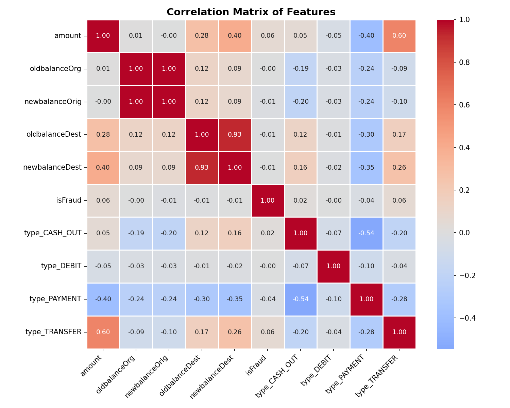
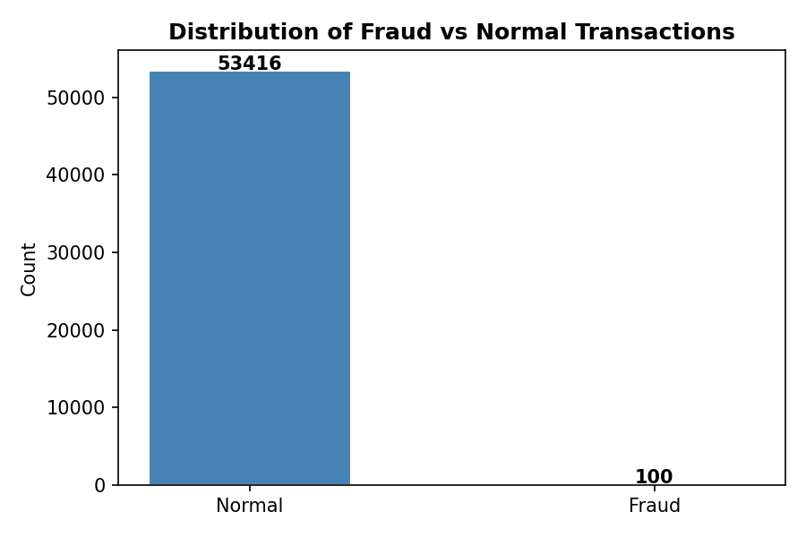
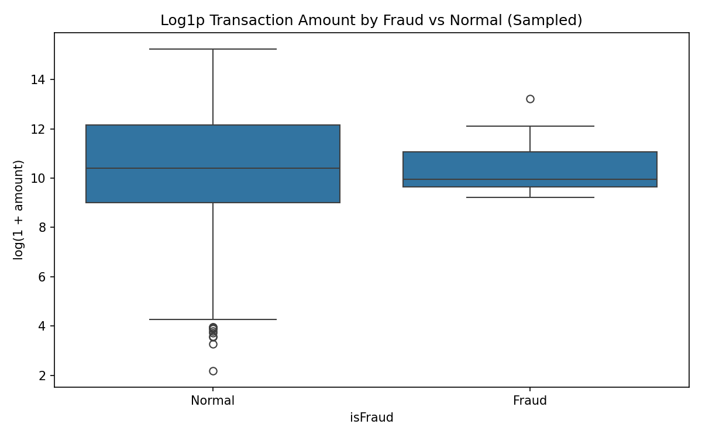
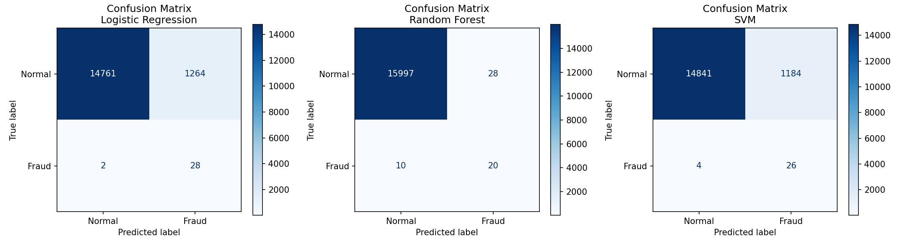

<!DOCTYPE html>
<html lang="en">
<head>
    <meta charset="UTF-8">
    <meta name="viewport" content="width=device-width, initial-scale=1.0">
    <title>Fraud Detection Project</title>
</head>
<body>

<h1>💳 Fraud Detection System using Machine Learning</h1>

<h2>📌 Project Overview</h2>

This project detects fraudulent financial transactions using Machine Learning.
The goal is to identify suspicious transactions based on features like amount, account balances, and transaction type.

<blockquote>Due to the severe class imbalance, <strong>SMOTE</strong> was applied to improve fraud detection performance.</blockquote>

<h2>📂 Dataset Description</h2>

The dataset contains <strong>53,516 transactions</strong> after cleaning.

<table>
    <tr>
        <th>Feature</th>
        <th>Description</th>
    </tr>
    <tr><td>step</td><td>Time step of the transaction</td></tr>
    <tr><td>type</td><td>Transaction type (TRANSFER, PAYMENT, CASH_OUT, etc.)</td></tr>
    <tr><td>amount</td><td>Transaction amount</td></tr>
    <tr><td>nameOrig</td><td>Sender account ID</td></tr>
    <tr><td>oldbalanceOrg</td><td>Sender balance before transaction</td></tr>
    <tr><td>newbalanceOrig</td><td>Sender balance after transaction</td></tr>
    <tr><td>nameDest</td><td>Receiver account ID</td></tr>
    <tr><td>oldbalanceDest</td><td>Receiver balance before transaction</td></tr>
    <tr><td>newbalanceDest</td><td>Receiver balance after transaction</td></tr>
    <tr><td>isFraud</td><td>Target variable (1 = Fraud, 0 = Normal)</td></tr>
    <tr><td>isFlaggedFraud</td><td>Flagged fraud indicator</td></tr>
</table>

<strong>Fraud distribution:</strong>

<ul>
    <li>Normal transactions: 53,416 (≈ 99.81%)</li>
    <li>Fraud transactions: 100 (≈ 0.19%)</li>
</ul>

<h2>⚙️ Data Preprocessing</h2>
<ol>
    <li>Removed missing values and duplicates</li>
    <li>Converted categorical feature <code>type</code> using One-Hot Encoding</li>
    <li>Dropped non-informative features: <code>step</code>, <code>nameOrig</code>, <code>nameDest</code>, <code>isFlaggedFraud</code></li>
    <li>Converted <code>amount</code> to numeric</li>
    <li>Split dataset into training (70%) and testing (30%)</li>
    <li>Balanced the training data using <strong>SMOTE</strong></li>
    <li>Standardized features for SVM using <strong>StandardScaler</strong></li>
</ol>

<h2>📊 Exploratory Data Analysis (EDA)</h2>
<h3>1️⃣ Correlation Matrix</h3>

<h3>2️⃣ Fraud vs Normal Distribution</h3>

<h3>3️⃣ Transaction Amount Boxplot</h3>

<h3>4️⃣ Confusion Matrices</h3>

<h2>🤖 Machine Learning Models</h2>
<h3>1️⃣ Logistic Regression</h3>

Linear model, used <code>class_weight='balanced'</code>.  
High recall for fraud but low precision.

<h3>2️⃣ Random Forest</h3>

Ensemble model, handles nonlinear patterns. Best performance among tested models.

<table>
    <tr><th>Metric</th><th>Fraud</th></tr>
    <tr><td>Precision</td><td>0.42</td></tr>
    <tr><td>Recall</td><td>0.67</td></tr>
    <tr><td>F1-score</td><td>0.51</td></tr>
</table>

<h3>3️⃣ SVM</h3>

RBF kernel with scaled features. High recall but low precision, similar to Logistic Regression.

<h2>🔧 Hyperparameter Tuning (Random Forest)</h2>
<pre><code>param_grid = {
    'n_estimators': [100, 200, 300],
    'max_depth': [10, 20, None],
    'min_samples_split': [2, 5, 10]
}</code></pre>

<strong>Best parameters:</strong>

<pre><code>{'n_estimators': 100, 'max_depth': None, 'min_samples_split': 2}</code></pre>

<h2>💾 Model Saving</h2>
<pre><code>joblib.dump(best_rf, 'fraud_rf_model.pkl')
joblib.dump(scaler, 'scaler.pkl')</code></pre>

<h2>🔮 Example Predictions</h2>
<table>
<tr><th>Transaction</th><th>Amount</th><th>Sender Balance</th><th>Receiver Balance</th><th>Result</th></tr>
<tr><td>Transaction 1</td><td>5,000</td><td>20,000 → 15,000</td><td>1,000 → 6,000</td><td>Normal ✅</td></tr>
<tr><td>Transaction 2</td><td>181</td><td>181 → 0</td><td>0 → 0</td><td>Fraud ⚠️</td></tr>
</table>

<h2>🛠 Technologies Used</h2>
<ul>
    <li>Python</li>
    <li>Pandas, NumPy</li>
    <li>Scikit-learn</li>
    <li>Imbalanced-learn (SMOTE)</li>
    <li>Matplotlib, Seaborn</li>
    <li>Joblib</li>
</ul>

<h2>📁 Project Structure</h2>
<pre><code>fraud-detection-project/
│
├── samples.csv
├── fraud_detection.ipynb
├── fraud_rf_model.pkl
├── scaler.pkl
│
├── plots/
│   ├── correlation_matrix.png
│   ├── fraud_distribution.png
│   ├── amount_boxplot.png
│   └── confusion_matrix.png
│
└── README.md</code></pre>

<h2>🚀 Future Improvements</h2>
<ul>
    <li>Train on larger datasets</li>
    <li>Try XGBoost / LightGBM</li>
    <li>Deploy as real-time API (Flask / FastAPI)</li>
    <li>Experiment with Deep Learning for better detection</li>
</ul>

<h2>👩‍💻 Author</h2>

<strong>Waad Sadek</strong> 
Machine Learning enthusiast building intelligent systems for fraud detection and predictive analytics.

</body>
</html>
